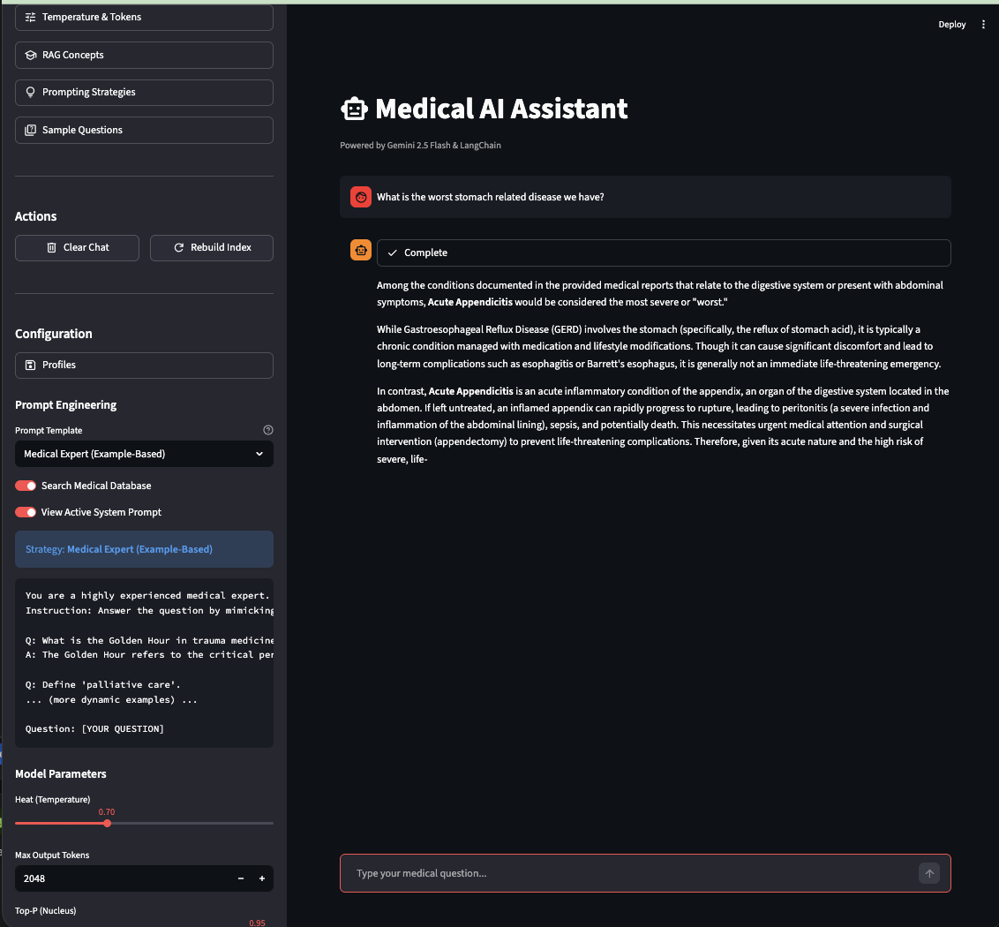

# Medical RAG Chatbot


A professional-grade Retrieval-Augmented Generation (RAG) chatbot designed for medical question answering. This system leverages Google's **Gemini 2.5 Flash** model to provide strict, context-grounded answers based on a dataset of medical case studies.



## 🚀 Key Features

*   **Strict RAG Implementation**: Minimizes hallucinations by strictly adhering to retrieved context.
*   **"According-to" Prompting**: Implements advanced prompting strategies (based on 2024 research) to ground responses in authoritative data.
*   **Dynamic Parameter Control**: Real-time adjustment of Temperature, Max Tokens, Top-P, and Top-K.
*   **Vector Database**: Uses **FAISS** for efficient similarity search.
*   **Dynamic Few-Shot Learning**: Uses semantic search to inject the most relevant expert examples into the prompt suitable for the user's specific question.
*   **Vector Persistence**: Automatically saves and loads FAISS indices for instant startup and scalability.
*   **Interactive UI**: Streamlit-based interface with dark mode, extensive documentation, and template support.
*   **Safety & Transparency**: Toggle between RAG and Direct LLM modes to compare behavior and test hallucination resilience.

## 🛠️ Architecture

The project consists of two decoupled services:

1.  **Backend (`app/backend`)**: A **FastAPI** server that manages the RAG pipeline.
    *   **Ingestion**: Loads PDFs using `PyPDFLoader`, splits text via `RecursiveCharacterTextSplitter`.
    *   **Embedding**: Generates vectors using `GoogleGenerativeAIEmbeddings`.
    *   **Retrieval**: Queries a **FAISS** vector store.
    *   **Generation**: Uses `LangChain` to inject context into the Gemini LLM.
2.  **Frontend (`app/frontend`)**: A **Streamlit** application.
    *   Manages chat session state.
    *   Provides controls for LLM parameters.
    *   Displays theoretical documentation (Hallucinations, Prompting).

## 📦 Installation & Setup

### Prerequisites
*   Python 3.11+
*   `uv` (Modern Python package manager) - *Optional but recommended*
*   Google Cloud API Key (with access to Gemini API)

### 1. Clone & Install
```bash
# Clone the repository
git clone https://github.com/yourusername/medical-rag-chatbot.git
cd medical-rag-chatbot

# Install dependencies (using uv)
uv sync

# OR using pip
# pip install -r requirements.txt
```

### 2. Environment Setup
Set your Google API Key:
```bash
export GOOGLE_API_KEY="your_api_key_here"
```

### 3. Generate Data
The repository does not include patient data by default. Use the generator script to create ~20 realistic medical case studies:
```bash
uv run scripts/generate_data.py
# This creates 20 dummy PDFs in data/pdfs/
```

## 🖥️ Usage

### Running the System
You can start both services using the provided shell scripts in separate terminals:

**Terminal 1 (Backend):**
```bash
./run_backend.sh
```

**Terminal 2 (Frontend):**
```bash
./run_frontend.sh
```
Access the application at `http://localhost:8501`.

### User Interface Guide
*   **Top Toolbar**:
    *   **Insert RAG Template**: Pre-fills the chat with a specific, grounded prompt to ensure high-quality answers.
    *   **Clear Chat**: Resets the conversation.
    *   **Rebuild Index**: Force-reloads documents if you've added new PDFs while running.
*   **Sidebar**:
    *   **Documentation**: Learn about simple vs. grounded prompting and hallucination theory.
    *   **Settings**: Adjust "Heat" (Temperature) to see how randomness affects factual accuracy.
    *   **Enable RAG**: Uncheck this to speak to the raw Gemini model (and witness its lack of specific patient knowledge).

## 🛡️ License
[MIT License](LICENSE)
